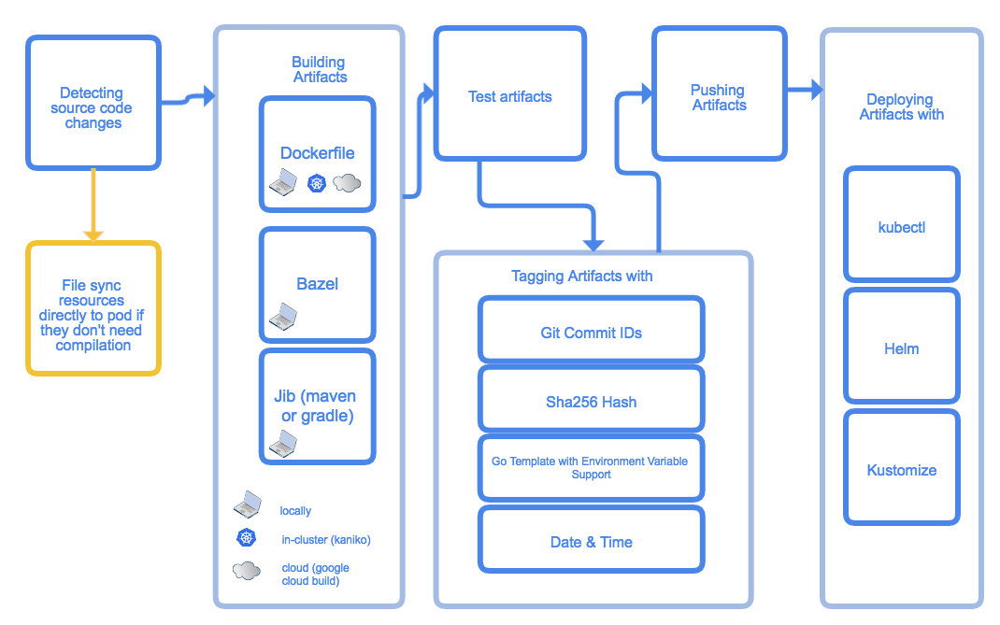

---------------------

Skaffold is a command line tool that facilitates continuous development for
Kubernetes applications. You can iterate on your application source code
locally then deploy to local or remote Kubernetes clusters. Skaffold handles
the workflow for building, pushing and deploying your application. It also
provides building blocks and describe customizations for a CI/CD pipeline.

## Features

* Fast local Kubernetes Development
  * **optimized source-to-k8s** - Skaffold detects changes in your source code and handles the pipeline to
  **build**, **push**, and **deploy** your application automatically with **policy based image tagging** and **highly optimized, fast local workflows**
  * **continuous feedback** - Skaffold automatically manages logging and port-forwarding   
* Skaffold projects work everywhere
  * **share with other developers** - Skaffold is the easiest way to **share your project** with the world: `git clone` and `skaffold run`
  * **context aware** - use Skaffold profiles, user level config, environment variables and flags to describe differences in environments
  * **CI/CD building blocks** - use `skaffold run` end-to-end or just part of skaffold stages from build to deployment in your CI/CD system 
* skaffold.yaml - a single pluggable, declarative configuration for your project  
  * **skaffold init** - Skaffold discovers your files and generates its own config file
  * **multi-component apps** - Skaffold supports applications consisting of multiple components 
  * **bring your own tools** - Skaffold has a pluggable architecture to allow for different implementations of the stages
* Lightweight 
  * **client-side only** - Skaffold does not require maintaining a cluster-side component, so there is no overhead or maintenance burden to
  your cluster.
  * **minimal pipeline** - Skaffold provides an opinionated, minimal pipeline to keep things simple  

## Install

See [Github Releases](https://github.com/GoogleContainerTools/skaffold/releases)

## Demo 

## A Glance at Skaffold Workflow and Architecture

Skaffold simplifies your development workflow by organizing common development
stages into one simple command. Every time you run `skaffold dev`, the system

1. Collects and watches your source code for changes
1. Syncs files directly to pods if user marks them as syncable   
1. Builds artifacts from the source code
1. Tests the built artifacts using container-structure-tests
1. Tags the artifacts
1. Pushes the artifacts
1. Deploys the artifacts
1. Monitors the deployed artifacts
1. Cleans up deployed artifacts on exit (Ctrl+C) 
   
What's more, the pluggable architecture is central to Skaffold's design, allowing you to use
the tool you prefer in each stage. Also, Skaffold's `profiles` feature grants
you the freedom to switch tools as you see fit depending on the context. 

For example, if you are coding on a local machine, you can configure Skaffold to build artifacts
with local Docker daemon and deploy them to minikube
using `kubectl`, the Kubernetes command-line interface and when you finalize your
design, you can switch to the production profile and start building with
Google Cloud Build and deploy with Helm.

Skaffold supports the following tools:

* Build
  * Dockerfile locally
  * Dockerfile in-cluster (kaniko)
  * Dockerfile on cloud (Google Cloud Build)
  * Bazel locally
  * Jib Maven/Gradle locally
* Test 
  * with container-structure-test
* Deploy 
  * Kubernetes Command-Line Interface (`kubectl`)
  * Helm
  * kustomize
* Tag 
  * tag by git commit
  * tag by current date&time 
  * tag by environment variables based template
  * tag by checksum of the source code
* Push 
    * don't push - keep the image on the local daemon
    * push to registry 

Besides the above steps, skaffold also automatically manages the following utilities for you: 

* forwards container ports to your local machine using `kubectl port-forward`
* aggregates all the logs from the deployed pods

## Documentation

Documentation for latest release: http://skaffold.dev

Documentation for latest build: http://skaffold-latest.firebaseapp.com  

## More examples

Check out our [examples page](./examples)

##  Community
- [skaffold-users mailing list](https://groups.google.com/forum/#!forum/skaffold-users)
- [#skaffold on Kubernetes Slack](https://kubernetes.slack.com/messages/CABQMSZA6/)

There is a bi-weekly Skaffold users meeting at 9:30am-10am PST hosted on hangouts under "skaffold". 
Everyone is welcome to add suggestions to the [agenda](https://docs.google.com/document/d/1mnCC_fAI3pmg3Vb2nMJyPk8Qtjjuapw_BTyqI_dX7sk/edit) and attend. 
Join the [skaffold-users mailing list](https://groups.google.com/forum/#!forum/skaffold-users) to get the calendar invite directly on your calendar.

