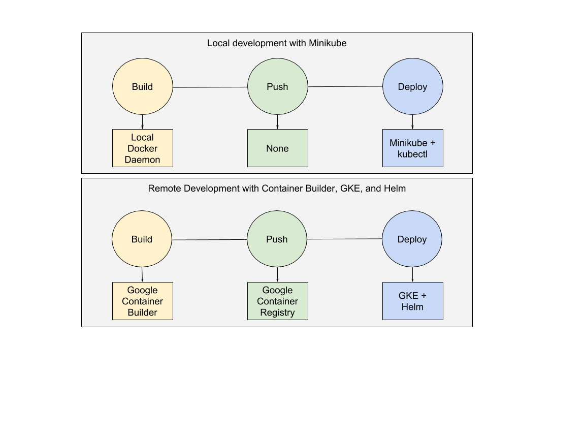

# Skaffold

Skaffold is a command line tool that facilitates continuous development for Kubernetes applications. You can iterate on your 
application source code locally then deploy to local or remote Kubernetes clusters. Skaffold handles the workflow for building,
pushing and deploying your application. It can also be used in an automated context such as a CI/CD pipeline to leverage the same 
workflow and tooling when moving applications to production.

- [Skaffold](#skaffold)
  - [Features](#features)
  - [Pluggability](#pluggability)
- [Operating modes](#operating-modes)
  - [skaffold dev](#skaffold-dev)
  - [skaffold run](#skaffold-run)
- [Demo](#demo)  
- [Getting Started with Local Tooling](#getting-started-with-local-tooling)
  - [Installation](#installation)
  - [Iterative Development](#iterative-development)
  - [Run a deployment pipeline once](#run-a-deployment-pipeline-once)
- [Future](#future)
- [Community](#community)

### Features
-  No server-side component. No overhead to your cluster.
-  Detect changes in your source code and automatically build/push/deploy.
-  Image tag management. Stop worrying about updating the image tags in Kubernetes manifests to push out changes during development.
-  Supports existing tooling and workflows. Build and deploy APIs make each implementation composable to support many different workflows.
-  Support for multiple application components. Build and deploy only the pieces of your stack that have changed.
-  Deploy regularly when saving files or run one off deployments using the same configuration.

### Pluggability
Skaffold has a pluggable architecture that allows you to choose the tools in the developer workflow that work best for you.


## Operating modes
### skaffold dev
Updates your deployed application continually:
-  Watches your source code and the dependencies of your docker images for changes and runs a build and deploy when changes are detected
-  Streams logs from deployed containers
-  Continuous build-deploy loop, only warn on errors

### skaffold run
Run runs a Skaffold pipeline once, exits on any errors in the pipeline.  
Use for:
-  Continuous integration or continuous deployment pipelines
-  Sanity checking after iterating on your application

## Demo


## Getting Started with Local Tooling

For getting started with Google Kubernetes Engine and Container Builder [go here](docs/quickstart-gke.md). Otherwise continue
below to get started with a local Kubernetes cluster.

### Installation

You will need the following components to get started with Skaffold:

1. skaffold
   -  To download the latest Linux build, run:
      -  `curl -Lo skaffold https://storage.googleapis.com/skaffold/releases/latest/skaffold-linux-amd64 && chmod +x skaffold && sudo mv skaffold /usr/local/bin`
   -  To download the latest OSX build, run:
      -  `curl -Lo skaffold https://storage.googleapis.com/skaffold/releases/latest/skaffold-darwin-amd64 && chmod +x skaffold && sudo mv skaffold /usr/local/bin`

1. Kubernetes Cluster
   -  [Minikube](https://kubernetes.io/docs/tasks/tools/install-minikube/),
      [GKE](https://cloud.google.com/kubernetes-engine/docs/how-to/creating-a-container-cluster),
      [Docker for Mac (Edge)](https://docs.docker.com/docker-for-mac/install/) and [Docker for Windows (Edge)](https://docs.docker.com/docker-for-windows/install/)
      have been tested but any Kubernetes cluster will work.

1. [kubectl](https://kubernetes.io/docs/tasks/tools/install-kubectl/)
   -  Configure the current-context with your target cluster for development

1. docker

1. Docker image registry
   -  Your docker client should be configured to push to an external docker image repository. If you're using a minikube or Docker for Desktop cluster, you can skip this requirement.
   -  If you are using Google Container Registry (GCR), choose one of the following:
        1. Use `gcloud`'s Docker credential helper: Run [`gcloud beta auth configure-docker`](https://cloud.google.com/sdk/gcloud/reference/beta/auth/configure-docker)
        1. Install and configure GCR's standalone cred helper: [`docker-credential-gcr`](https://github.com/GoogleCloudPlatform/docker-credential-gcr#installation-and-usage)
        1. Run `gcloud docker -a` before each development session.

### Iterative Development

1. Clone this repostiory to get access to the examples.

```shell
git clone https://github.com/GoogleCloudPlatform/skaffold
```

1. Change directories to the `getting-started` example.

```shell
cd examples/getting-started
```

1. Change the `imageName` and `IMAGE_NAME` parameters of `skaffold.yaml`. This should be a fully qualified image name that your docker client is configured to push to.

1. Run `skaffold dev`.

```console
$ skaffold dev
Starting build...
Found minikube or Docker for Desktop context, using local docker daemon.
Sending build context to Docker daemon   7.68kB
Step 1/5 : FROM golang:1.9.4-alpine3.7
 ---> fb6e10bf973b
Step 2/5 : WORKDIR /go/src/github.com/GoogleCloudPlatform/skaffold/examples/getting-started
 ---> Using cache
 ---> 259762612c45
Step 3/5 : CMD ./app
 ---> Using cache
 ---> e2cb5a3e8812
Step 4/5 : COPY main.go .
 ---> Using cache
 ---> 149d709c4fd9
Step 5/5 : RUN go build -o app main.go
 ---> Using cache
 ---> a688409b7e69
Successfully built a688409b7e69
Successfully tagged 97e2a15e650c6470fb30e1cdcc808b59:latest
Successfully tagged changeme:a688409b7e696dec944a36a1fe4063fa7b6726891be75809d4ec8f180e2ccc96
Build complete.
Starting deploy...
Deploying examples/getting-started/k8s-pod.yaml...
Deploy complete.
[getting-started getting-started] Hello world!
```

1. Skaffold has done the following for you:

 - Build an image from the local source code
 - Tag it with its sha256
 - Sets that image in the Kubernetes manifests defined in `skaffold.yaml`
 - Deploy the Kubernetes manifests using `kubectl apply -f`

1. You will see the output of the pod that was deployed:

```console
[getting-started getting-started] Hello world!
[getting-started getting-started] Hello world!
[getting-started getting-started] Hello world!
```

Now, update `main.go`

```diff
diff --git a/examples/getting-started/main.go b/examples/getting-started/main.go
index 64b7bdfc..f95e053d 100644
--- a/examples/getting-started/main.go
+++ b/examples/getting-started/main.go
@@ -7,7 +7,7 @@ import (

 func main() {
        for {
-               fmt.Println("Hello world!")
+               fmt.Println("Hello jerry!")
                time.Sleep(time.Second * 1)
        }
 }
```

Once you save the file, you should see the pipeline kick off again to redeploy your application:
```console
[getting-started getting-started] Hello jerry!
[getting-started getting-started] Hello jerry!
```

### Run a deployment pipeline once
There may be some cases where you don't want to run build and deploy continuously. To run once, use:
```console
$ skaffold run -f skaffold.yaml
```

## [Build from Source](/docs/building.md)

## Future

1. Detect application information and create initial deployment manifests
1. Create pipelines for CI/CD systems to facilitate transitions to production

## Community
- [skaffold-users mailing list](https://groups.google.com/forum/#!forum/skaffold-users)
