# New Skaffold Render and Deploy (v2)

* Author(s): [Yuwen Ma](https://github.com/yuwenma)
* Design Shepherd: 
	- [Vic Iglesias](https://github.com/viglesiasce)
	- [Tejal Desai](https://github.com/tejal29)
	- [Nick Kubala](https://github.com/nkubala)

* Last Updated: 2021-05-07
* Status: Approved/ Under implementation

## Glossary

#### DRY configuration 

Raw application configuration. 

It means the configuration may use variants or base/overlays (kustomize structured layout) but not extended and can’t be understood by the cluster directly. The raw config is not validated or passed through any validation or other operation checks yet.

#### WET configuration

Manipulated application configuration.

It has been flattened (from the DRY structure) and processed through a series of validation, generation and transformation operations and is a pure kubernetes resource and can be applied to the cluster directly.

## Objectives

`skaffold` v2 is aimed at redesigning the skaffold workflow to decouple these two orthogonal concerns:

1. Hydration (aka “rendering”) of configuration: [A DRY configuration](#DRY-configuration) is transformed, generated, and validated into [WET configs](#WET-configuration).

2. Deployment (aka “apply”) of configuration: The WET configuration is applied to the K8S control plane.

This `skaffold` v2 will use [`kpt`](https://github.com/GoogleContainerTools/kpt), which provides the canonical API(s) and toolchain for configuration packaging, hydration, and deployment, to enable the `skaffold` config generation, transformation and validation in a new *"render"* stage and replace the `skaffold` "deploy" stage with more accurate pruning.

## Background

### An overview of the skaffold workflow

`skaffold`, as a centralized tool for application’s local development as well as CI/CD workflow, leverages `kubectl`, `kustomize`, `helm` or/and `kpt` for config management and deployment. The workflow is composed of a series of steps as below.

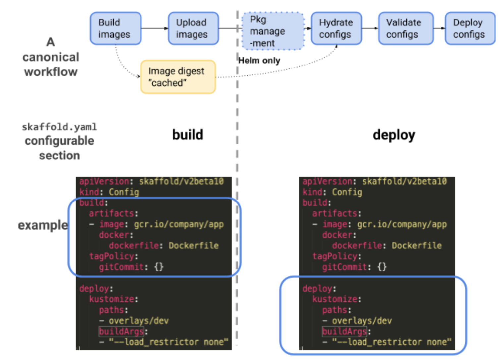

Users are expected to configure one “deployer” in the skaffold.yaml deploy section. “Deployer” refers to the tools used to manage and deploy the configurations. Currently skaffold supports 4 "deployers": `kpt`, `kustomize`, `helm`, `kubectl`. Below table presents the main commands running in each step when a certain deployer is chosen (trivial flags and options are ignored). 

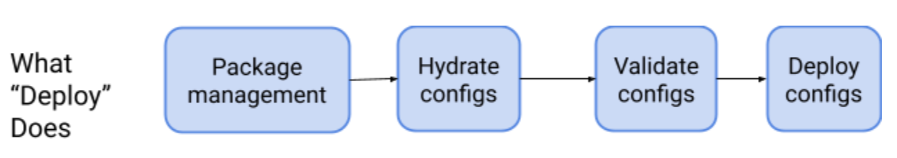
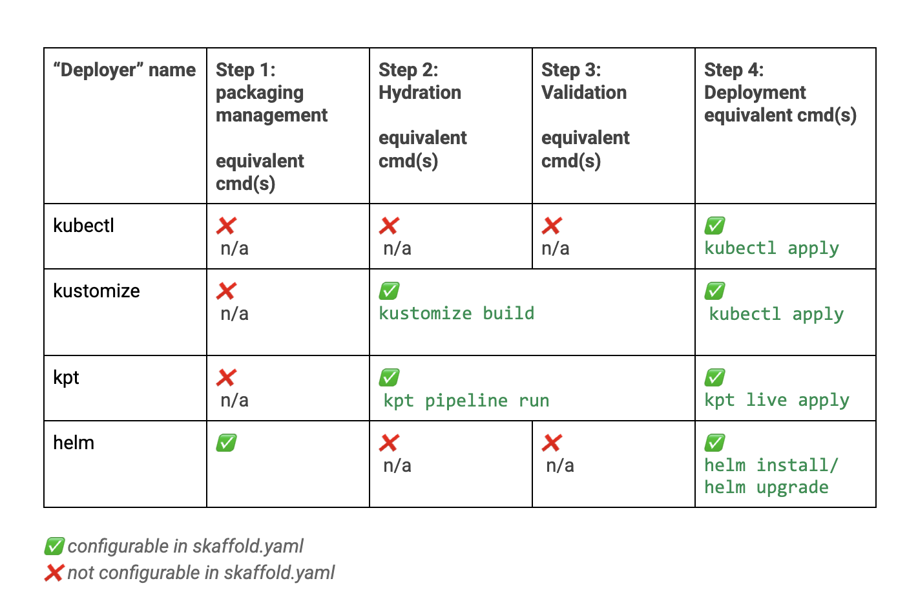

### Problems

From the above table and some user feedback (e.g. [3905](https://github.com/GoogleContainerTools/skaffold/issues/3905) [4856](https://github.com/GoogleContainerTools/skaffold/issues/4856) [4356](https://github.com/GoogleContainerTools/skaffold/issues/4356), we can summarize the skaffold deployment issues as below: 

#### [User facing] Confusing scope of “deployer” 

From the above table, there’s a misalignment between the "deployer" name and the tool’s actual "deployment" functionality. 

For instance, `kustomize` "deployer" has no deployment operations (it relies on `kubectl` to deploy), but it is called a "deployer"; The `kustomize` CLI does have config validation functionalities (via `kustomize config`), but the `kustomize` "deployer" has a no-op in the validation stage (Step 3). This "deployer" behavior confuses customers who understand `kustomize` and want to use `kustomize` in `skaffold`. 

#### [User facing] Unexpected `skaffold` usage compound

Though `skaffold` allows users to use different "deployers" together in a single workflow, a mixed usage of "deployers" normally means users are seeking workarounds to fill in the gaps due to the differentiation of the deployers’ scope and design principle (`kustomize` does not do in-place file changes and has no real "deploy" feature, `kubectl` deploys without good handling on prune, `helm` is package management tool and is imperative). Mixing the deployers under the hood in the deploy section gives the *wrong* signals that:

- the deployers should be used as a mix. This will exacerbate each deployer’s known problems and make the skaffold more brittle.  
- `skaffold` should handle the issues caused by the conflicts/misalignment among the "deployers".

#### Limitations of current kpt deployer

`skaffold` has [a kpt "deployer"](https://skaffold.dev/docs/references/yaml/#deploy-kpt) which can support basic declarative config validation and hydration.  This kpt deployer (stable version) has been released 2020 Dec, designed and implementated based on kpt version v0.34.0, which version does not have the declarative hydration in Kptfile file (new features in the [kpt v1 release](https://github.com/GoogleContainerTools/kpt/releases)).

Thus,  the current skaffold kpt "deployer" has the following limitations:

1. `kpt` deployer defines its own `kpt fn` stdin/stdout pipe to build up a validation pipeline and will not be compatible with `kpt` v1.
Since the `kpt` deployer wraps the `kpt fn` pipeline inside the `skaffold`, failovers may not always be handled properly.  
2. Skaffold deployers has no config resource path DAG detection, which will be properly handled by kpt v1.
3. `kpt` deployer unifies kustomize into the kpt pipeline by switching the kyaml “ResourceList” to k8s resource and switching back after running kustomize build. These extra steps are not declarative native and sacrifices the flexibility of declarative config management (e.g. the order of the hydration in a pipeline is hard-coded).
4. `kpt` deployer adds some additional steps to handle the kpt version incompatibility issues. E.g. both config.kubernetes.io/function and config.k8s.io/function annotations are supported, network flag is required to be configured in both skaffold.yaml and the declarative kpt function file, resources with config.kubernetes.io/local-config annotation is removed from sinkDir resource. 
5. `kpt` deployer does not have a package management solution for skaffold.

## Proposal

To obtain the Objectives and to fix the issues listed in the background, we propose the following design:

Create a new **rendering** functionality to manage the configuration hydration. This "rendering" splits the hydration functionality from the existing "deployment" step and is configurable via a new "render" section in the `skaffold.yaml`. Both rendering and deployment fully relies on `kpt` as the *backbone*:

- Leverage the kpt definition to define "transformation" and "validation" operations in `skaffold.yaml`.
- Run each operation declarative in the `kpt` managed container runtime. 
- Support package management through `kpt` package and declarative setters.
- kpt launches together with skaffold as a builtin tool.
- Deprecate the `helm` operation with the `kpt` "helm-inflator" image.
- Deprecate the kustomize operation with the kpt `kustomize` image, and unify the `kpt` and `kustomize` operations into the `kpt` declarative pipeline.
- Strengthen the "deploy" functionality (or step) by removing the existing hydration operation (e.g. kustomize build) and using `kpt` to apply the config to the cluster (e.g. no deployers are specified).  


## Detailed Design

The new skaffold *render* uses the `kpt` ["kustomize"](https://github.com/GoogleContainerTools/kpt/issues/1447) function and "helm-inflator" function in lieu of `kustomize` and `helm`. So as `kustomize` resource and `helm` charts can fit into the `kpt` hydration and work together with other kpt validation and mutation functions in a pipeline.

The new skaffold *deploy* only focuses on WET (See glossary) configurations and uses `kpt live` to deploy the config to the cluster. Here, `kpt` uses ResourceGroup and three-way merge pruning, so it is guaranteed the applied configs are accurate and reliable.

### An overview of the scope and internal operation changes

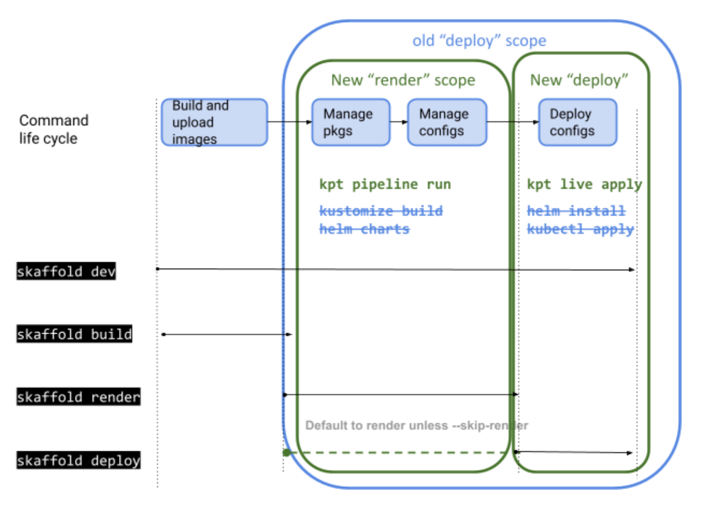

### New "render"

Add a new render (has decided to name to `.manifests`, the following graphs still using ".render") in the `skaffold.yaml`. This section contains two modes to hydrate configuration: One is to point to a declarative Kptfile file via `.manifests.kpt` (a.k.a kpt-managed), the other is to write the hydration pipeline directly in the `skaffold.yaml` (a.k.a skaffold-managed).

#### kpt-managed mode

The kpt-managed mode is for customers who are already the `kpt` hydration users (using the "pipeline" in Kptfile) and understand [declarative application management](https://github.com/kubernetes/community/blob/master/contributors/design-proposals/architecture/declarative-application-management.md). Thus, there’s no need to ask them to re-write the similar config in skaffold.yaml.


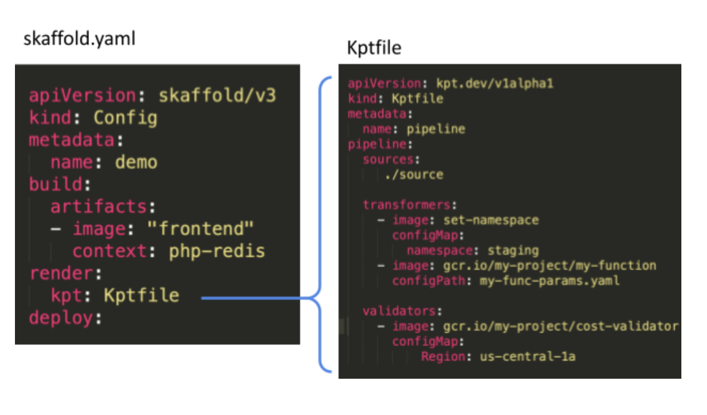

#### skaffold-managed mode

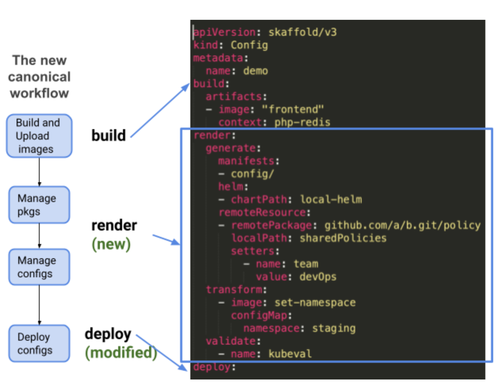

The skaffold-managed hydration has three types of operations: `generate`, `transform` and `validate`. The dry config is manipulated through each operation in the order as they are written in the `skaffold.yaml`.

-  **generate**  defines the source of the configurations. It contains the raw manifests (kubernetes resources), `kustomize` resources (kustomization.yaml files and base/overlay resources)  and/or `helm` charts as the configuration source. Besides, It provides the option to fetch and update the `kpt` packages as resources.

	*Note*: `helm` is only presented to users as "helm charts". Under the hood, the helm charts are managed by the `kpt`. See kpt [helm-inflator](https://github.com/GoogleContainerTools/kpt-functions-catalog/tree/master/examples/contrib/helm-inflator) example (the image prvoides minimum helm features, more work is needed before it can be used in skaffold). This allows `skaffold` to unify different config resources and pass them all through the kpt validation pipeline. What’s more, users are no longer required to install `kustomize`, `helm` or `kpt` and to fix the version conflicts.

- **transform** defines the operations to mutate the configuration. Different than the `kpt` transformers, `skaffold` only accepts a **whitelisted set** of transformers. This is to control the `skaffold dev` qualities and gives a reliable render experience.

- **validate** defines the operations to validate the configuration. Same as transform, only a whitelisted set of validators are accepted. E.g. `kubeval`, `conftest`.
	

### "render" interface in `skaffold.yaml`

``` yaml

apiVersion: skaffold/v3
kind: Config
metadata:
   name: skaffold-config
build:

render:
   # Optional. kpt-managed mode. The path to the Kptfile. If provided, the other "render" options are not allowed.
   kpt: [string]

   # This field defines the dry manifests from a variety of sources.
   generate:
      
      # Optional. A list of paths to the raw manifests or/and kustomize directory.  
      manifests: [array]


      # Optional. A list of helm charts to fetch. This is done via kpt helm-inflater image under the hood.
      helmCharts:
         
         # Required. The helm chart path.
         - path: 
         
         # Required. The paths to the values.yaml files.
         valuesFile: [array]

      # Optional. This field defines a set of transformation operations to run in series
      transform: 

         # Required. The transformer name. Can only accept skaffold whitelisted tools.
         - name: [string]

      # Optional. This field defines a set of validator operations to run in series.
      validate: 

         # Required. The validator image name. Can only accept skaffold whitelisted tool, e.g. kubeval  
         - name: [string]      

      
      # Optional. The path to the hydrated directory. 
      Output: [string]   

      # Optional. The flags passed to the `kpt fn` pipeline command directly.
      flags: ...

deploy: ...
```

#### An [example](https://gist.github.com/yuwenma/90610081f0b38a6002fb0b0f8b8567a3) of skaffold-managed hydration

#### An [example](https://gist.github.com/yuwenma/dbadad4ce420b1ae8bb3a374b6ad9667) of kpt-managed hydration

### New “deploy”

The `deploy` section in `skaffold.yaml` will be greatly simplified:

- `skaffold` decides to not support `helm` installation (deploy step) and only focuses on `helm` charts (render step). This means no helm deployer is needed.
	- The skaffold team have solicited feedback on whether users require Helm’s release functionality and the signal has been that it is not required or used. We will start without it and if needed add back the functionality.
	- Deployment via Helm is supported by many CI/CD and GitOps tools. Some users also wrap helm with other tools. So they aren't necessarily deploying directly via skaffold.
- Only `kpt live` is used to apply the WET configurations and users do not specify the deployer name in the deploy section. 

#### "deploy" interface in `skaffold.yaml`

```yaml
apiVersion: skaffold/v3
kind: Config
metadata:
  name: skaffold-config
build:
   …
render:
   …
deploy:

   # Optional. The path to the WET configuration. It not provided, using the output from the render step.
   dir: [String]

   # Optional. The kpt live inventory ID
   inventoryID: [String]

   # Optional. The kpt inventory namespace
   inventoryNamespace: [String] 

   # Optional. The `kpt live apply` flags. 
   # Unchanged fields.
   options: ...
```

### `skaffold` commands and flags

| command      | `skaffold.yaml` | comments
| :----------- | :-----------: |-----------: |
| `skaffold render` | `render.output` not given| By default, hydrate and show the WET config in stdout `kpt pipeline run --sink-mode=stdout`|
| `skaffold render` | `render.output: [PATH]`| hydrate and store the WET config to PATH ` kpt pipeline run --sink-mode=special-dir --output-dir=PATH` |
| `skaffold render --output [PATH2]`| `render.output: [PATH1]` | Hydrate and store the WET config in PATH2 (override `skaffold.yaml`) `kpt pipeline run --sink-mode=special-dir --output-dir=PATH2`|
| `skaffold deploy` |`deploy.dir` not given|*Render* and deploy
`kpt pipeline run --sink-mode=stdout | kpt live apply --`|
| `skaffold deploy` |`deploy.dir: [PATH]` |Only deploy `kpt live apply [PATH]`|
|`skaffold deploy --render-path [PATH2]`| `deploy.dir: [PATH1]`|Deploy and override PATH1 `kpt live apply [PATH2]`|
| `skaffold dev` | | Build, render and deploy|

### Integration of `kpt` pipeline and `skaffold` render 

Either *kpt-managed* Pipeline or *skaffold-managed* Pipeline is driven by a `kpt fn render` command (see below). This requires a `Kptfile` file. The *kpt-managed* approach finds the `Kptfile` from `.render.kpt`, and the *skaffold-managed* approach creates the `Kptfile` file on the fly.

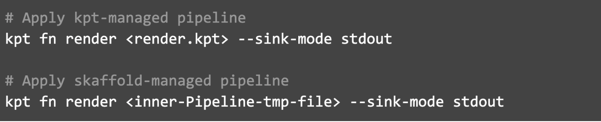

This `Kptfile` is built as shown below. Since kpt considers all resources under the `Kptfile` directory as the source. `skaffold` will create a temporary directory `.kpt-hydrated` to cache the `kustomize` DRY configs, `helm` charts, and the raw manifests. Before running `kpt`, these resources are copied to the temporary directory, and `kpt` will hydrate the configurations in place.

``` yaml
apiVersion: kpt.dev/v1alpha1
kind: Kptfile
metadata:
  name: skaffold-kpt-builtin-pipeline
pipeline:
   mutators:

      # items directly defined in skaffold.yaml. It can only be the tools skaffold whitelisted. 
      - image: <render.transform.customize[0].name> 
      # specific arguments that could defer per whitelisted tool.
        configPath/configPath:      

      - image: <render.transform.customize[1].name> 
      ...


   validators:
  
      # items directly defined in skaffold.yaml. It can only be the tools skaffold whitelisted. E.g. kubeval. 
      - image: <render.validators.customize[0].name> 
      # specific arguments that could defer per whitelisted tool.
        configPath/configPath: 

      - image: <render.validators.customize[1].name> 
      ...

``` 

The following graph describes the commands and operations to generate the kpt sources.

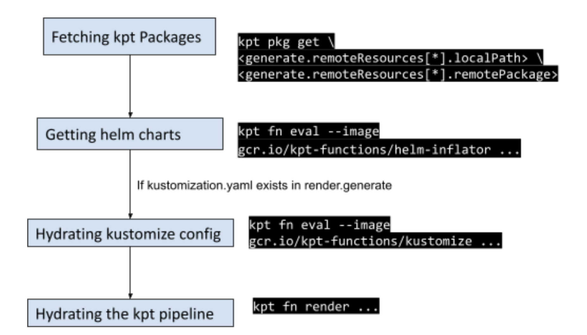

### Integration of `kpt` live  and `skaffold` deploy

`kpt` relies on `ResourceGroup` to accurately deploy the WET configurations to the cluster.  This requires the ResourceGroup CRD to be installed on the cluster side. 

`skaffold dev` and `skaffold deploy` commands will detect and ask for user permissions before installing the `ResourceGroup` controller. It calls the following `kpt` commands. 

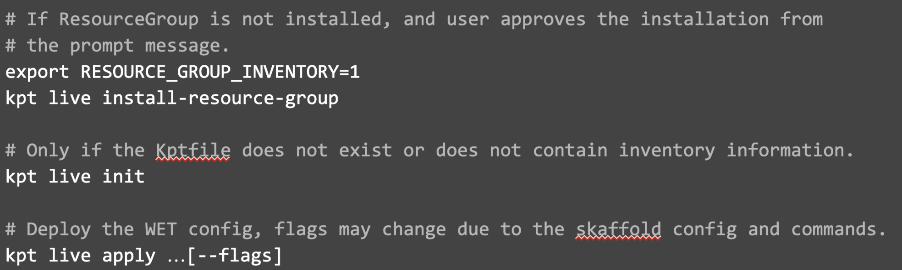

*Note*: `skaffold` v2 will not provide the migration from `kpt` v0.X to `kpt` v1. Users can follow [this guide](https://googlecontainertools.github.io/kpt/reference/live/migrate/) to establish the `kpt` migration themselves.

### Builtin `kpt`

`skaffold` will have `kpt` embedded via go bindata, which ship together with the skaffold binary to guarantee the versions match.

Currently, `skaffold` requires users to install `helm`, `kubectl`, `kustomize` and `kpt` and manage the version skew themselves. By making `kpt` and `skaffold` a bundle, users no longer need to install ANY other tools (`helm` and `kustomize` are used as `kpt` functions).

## Migration Plan

### `Helm` "deployer" 

Customers can choose either to continue using `helm` deployer or migrate to `kpt` in both "render" and "deploy" stages. We provide users an easy approach to migrate `helm` "deployer" to the new skaffold. But if users continue using `helm`, we will not provide no further support for the new `kpt` features.

This guarantees the `skaffold` v2 is backward compatible with `helm` and users have a seamless experience when introduced to the new render UI. 

#### The migration command

Users can run the existing skaffold `fix` command to migrate to the new skaffold.

This will wipe and recreate the `skaffold.yaml` as below. After the migration, if users make a `helm` config change in `skaffold.yaml`, skaffold dev (and other skaffold commands enabling file watcher) will recreate the following kpt resources.  

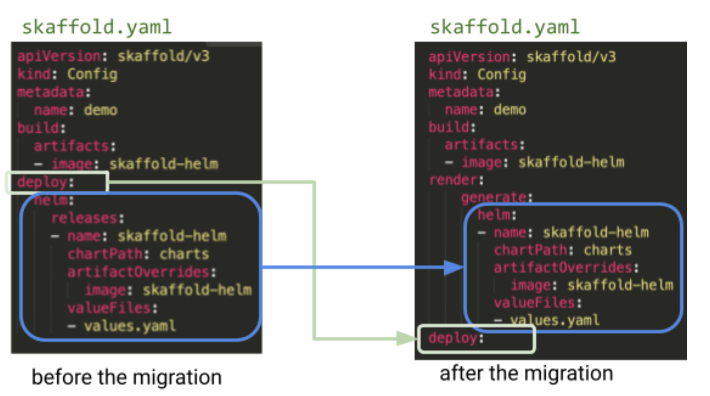

#### Under the hood

Though the new UI looks similar except moving helm from "deploy" to "render", the actual implementation is very different. Instead of calling the `helm` CLI, the `skaffold-helm-inflator` functions are used to convert the `Helm` charts to a kpt [`ResourceList.items`]（https://googlecontainertools.github.io/kpt/guides/producer/functions/#resourcelistitems). This function is expected to digest all the `helm` arguments listed in the `skaffold.yaml` reference doc [v2beta16](https://skaffold.dev/docs/references/yaml/#deploy-helm).


#### Phase 1

The [helm-inflator](https://github.com/GoogleContainerTools/kpt-functions-catalog/tree/master/examples/contrib/helm-inflator）) is used and it requires the helm config to be in the form of a ConfigMap resource. Note, this image does not fit into the kpt v1 Kptfile yet.

##### Step 1. Create `.kpt-pipeline` directory and run `kpt pkg init .kpt-pipeline/`

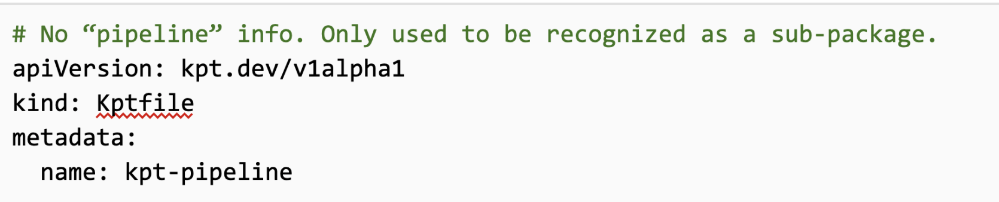

##### Step 2. Create `.kpt-pipeline/config-helm.yaml` file from `skaffold.yaml` `.render.generate.helm`

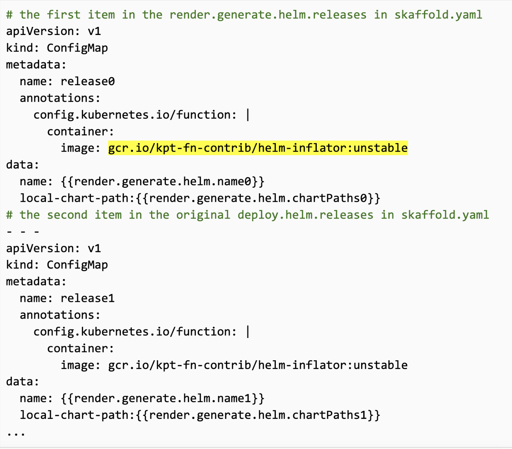

##### Step 3. Use the helm-inflator to convert the helm charts

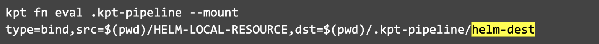

##### Step 4. Store the converted `helm` resource in the temporary directory

#### Phase 2

Most steps are similar to phase 1 except in step 3. Instead of calling the `kpt fn eval` command, we can edit the pipeline in `.kpt-pipeline/Kptfile` as below. (parameters may change, defer to the final helm-inflator-2 image)

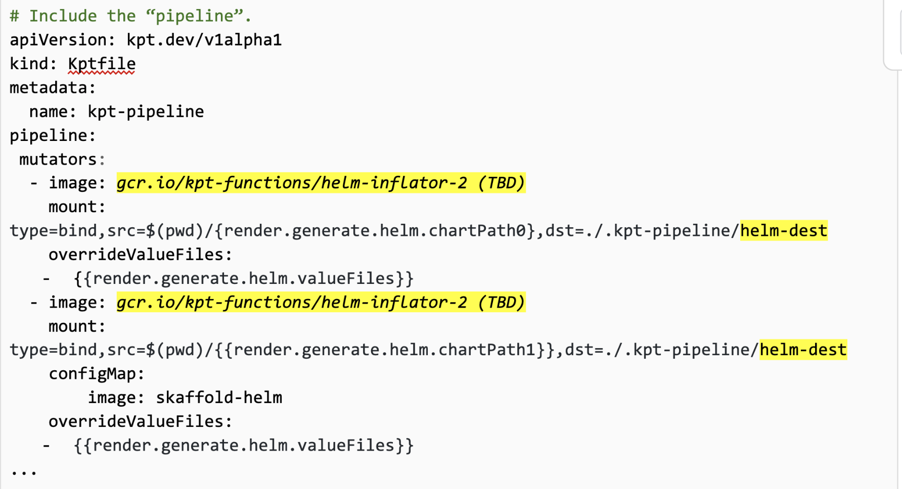

#### Phase 3

The `kpt` function format (ConfigMap) and *helm-inflator* images may change significantly in the future. More migration changes will happen defer to the final design of helm-inflator function and the `kpt` function configuration. 

### `kustomize` "deployer" 

`kustomize` deployer should be deprecated in three phases. The goal is to provide the `skaffold` users a seamless experience on migrating to skaffold V2.  

#### The migration command

Users can run the existing `skaffold fix` command to migrate to the new skaffold.

This will wipe and recreate the skaffold.yaml as below.

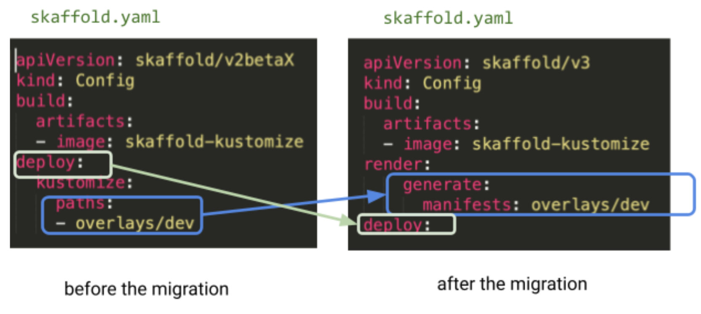

#### Under the hood

##### Phase 1
Providing a full `kustomize` image requires a lot of design, implementation (tracked [1447](https://github.com/GoogleContainerTools/kpt/issues/1447)) and testing. Before the kustomize image is available, `skaffold` commands continue using the `kustomize` CLI to build the kustomize configs and pass them through the `kpt` validation and mutation pipeline.

##### Step 1. Create `.kpt-pipeline/` directory and run `kpt pkg init .kpt-pipeline/.` 

Same as “helm deployer” migration step 1.

##### Step 2. Run `kustomize build`

Walk through the `.render.generate.manifests` and check if `kustomization.yaml` files exist. If so, run  `kustomize build {render.generate.manifests}` (this may require a tmp dir if manifests contain multiple resources) and store the stdout to `.kpt-pipeline/kustomize-dest`

#### Phase 2

Once the `kustomize`  kpt function (tracked [1447](https://github.com/GoogleContainerTools/kpt/issues/1447) is available, define the kustomize in Kptfile. Step 1-3 in phase 1 can be skipped.

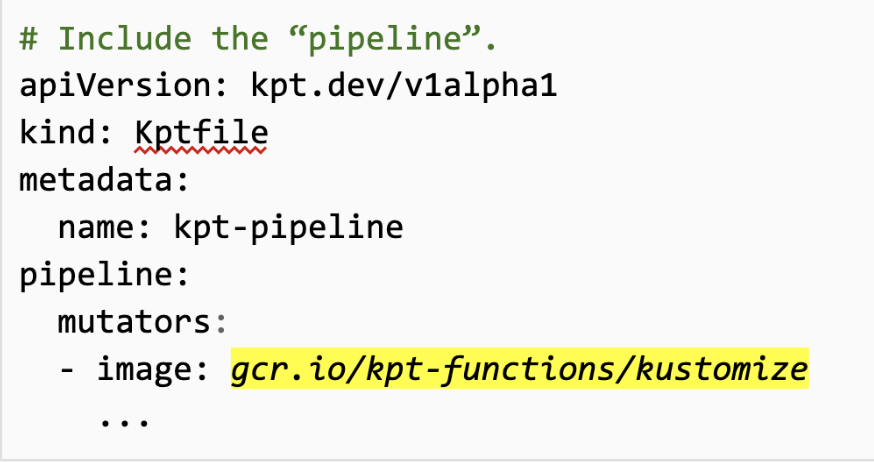

#### Phase 3

Defer to the unified kpt/kustomize, the kustomize and kpt may be further aligned with each other. And more migration changes are needed. 
