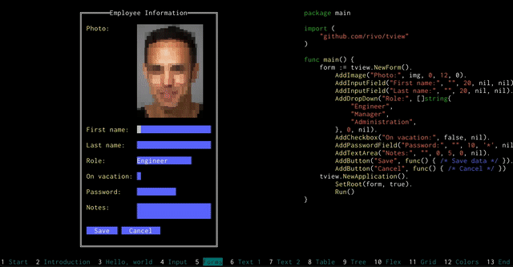

# Rich Interactive Widgets for Terminal UIs

[](https://pkg.go.dev/github.com/rivo/tview)
[](https://goreportcard.com/report/github.com/rivo/tview)

This Go package provides commonly used components for terminal based user interfaces.



Among these components are:

- __Input forms__ (including __text input__, __selections__, __checkboxes__, and __buttons__)
- Navigable multi-color __text views__
- Editable multi-line __text areas__
- Sophisticated navigable __table views__
- Flexible __tree views__
- Selectable __lists__
- __Images__
- __Grid__, __Flexbox__ and __page layouts__
- Modal __message windows__
- An __application__ wrapper

They come with lots of customization options and can be easily extended to fit your needs.

## Usage

To add this package to your project:

```bash
go get github.com/rivo/tview@master
```

## Hello World

This basic example creates a box titled "Hello, World!" and displays it in your terminal:

```go
package main

import (
	"github.com/rivo/tview"
)

func main() {
	box := tview.NewBox().SetBorder(true).SetTitle("Hello, world!")
	if err := tview.NewApplication().SetRoot(box, true).Run(); err != nil {
		panic(err)
	}
}
```

Check out the [GitHub Wiki](https://github.com/rivo/tview/wiki) for more examples along with screenshots. Or try the examples in the "demos" subdirectory.

For a presentation highlighting this package, compile and run the program found in the "demos/presentation" subdirectory.

## Projects using `tview`

- [K9s - Kubernetes CLI](https://github.com/derailed/k9s)
- [IRCCloud Terminal Client](https://github.com/termoose/irccloud)
- [Window manager for `tview`](https://github.com/epiclabs-io/winman)
- [CLI bookmark manager](https://github.com/Endi1/drawer)
- [A caving database interface written in Go](https://github.com/IdlePhysicist/cave-logger)
- [Interactive file browse and exec any command.](https://github.com/bannzai/itree)
- [A complete TUI for LDAP](https://github.com/Macmod/godap)
- [A simple CRM](https://github.com/broadcastle/crm)
- [Terminal UI for todist](https://github.com/cyberdummy/todoista)
- [Graphical kubectl wrapper](https://github.com/dcaiafa/kpick)
- [Decred Decentralized Exchange ](https://github.com/decred/dcrdex)
- [A CLI file browser for Raspberry PI](https://github.com/destinmoulton/pixi)
- [A tool to manage projects.](https://github.com/divramod/dp)
- [A simple app for BMI monitoring](https://github.com/erleene/go-bmi)
- [Stream TIDAL from command line](https://github.com/godsic/vibe)
- [Secure solution for fully decentralized password management](https://github.com/guillaumemichel/passtor/)
- [A growing collection of convenient little tools to work with systemd services](https://github.com/muesli/service-tools/)
- [A terminal based browser for Redis written in Go](https://github.com/nitishm/redis-terminal)
- [First project for the Computer Networks course.](https://github.com/pablogadhi/XMPPClient)
- [Test your typing speed in the terminal!](https://github.com/shilangyu/typer-go)
- [TUI Client for Docker](https://github.com/skanehira/docui)
- [SSH client using certificates signed by HashiCorp Vault](https://github.com/stephane-martin/vssh)
- [VMware vCenter Text UI](https://github.com/thebsdbox/vctui)
- [Bookmarks on terminal](https://github.com/tryffel/bookmarker)
- [A UDP testing utility](https://github.com/vaelen/udp-tester)
- [A simple Kanban board for your terminal](https://github.com/witchard/toukan)
- [The personal information dashboard for your terminal. ](https://github.com/wtfutil/wtf)
- [MySQL database to Golang struct](https://github.com/xxjwxc/gormt)
- [Discord, TUI and SIXEL.](https://gitlab.com/diamondburned/6cord)
- [A CLI Audio Player](https://www.github.com/dhulihan/grump)
- [GLab, a GitLab CLI tool](https://gitlab.com/profclems/glab)
- [Browse your AWS ECS Clusters in the Terminal](https://github.com/swartzrock/ecsview)
- [The CLI Task Manager for Geeks](https://github.com/ajaxray/geek-life)
- [Fast disk usage analyzer written in Go](https://github.com/dundee/gdu)
- [Multiplayer Chess On Terminal](https://github.com/qnkhuat/gochess)
- [Scriptable TUI music player](https://github.com/issadarkthing/gomu)
- [MangaDesk : TUI Client for downloading manga to your computer](https://github.com/darylhjd/mangadesk)
- [Go How Much? a Crypto coin price tracking from terminal](https://github.com/ledongthuc/gohowmuch)
- [dbui: Universal CLI for Database Connections](https://github.com/KenanBek/dbui)
- [ssmbrowse: Simple and elegant cli AWS SSM parameter browser](https://github.com/bnaydenov/ssmbrowse)
- [gobit: binance intelligence terminal](https://github.com/infl00p/gobit)
- [viddy: A modern watch command](https://github.com/sachaos/viddy)
- [s3surfer: CLI tool for browsing S3 bucket and download objects interactively](https://github.com/hirose31/s3surfer)
- [libgen-tui: A terminal UI for downloading books from Library Genesis](https://github.com/audstanley/libgen-tui)
- [kubectl-lazy: kubectl plugin to easy to view pod](https://github.com/togettoyou/kubectl-lazy)
- [podman-tui: podman user interface](https://github.com/containers/podman-tui)
- [tvxwidgets: tview extra widgets](https://github.com/navidys/tvxwidgets)
- [Domino card game on terminal](https://github.com/gusti-andika/card-domino.git)
- [goaround: Query stackoverflow API and get results on terminal](https://github.com/glendsoza/goaround)
- [resto: a CLI app can send pretty HTTP & API requests with TUI](https://github.com/abdfnx/resto)
- [twad: a WAD launcher for the terminal](https://github.com/zmnpl/twad)
- [pacseek: A TUI for searching and installing Arch Linux packages](https://github.com/moson-mo/pacseek)
- [7GUIs demo](https://github.com/letientai299/7guis/tree/master/tui)
- [tuihub: A utility hub/dashboard for personal use](https://github.com/ashis0013/tuihub)
- [l'oggo: A terminal app for structured log streaming (GCP stack driver, k8s, local streaming)](https://github.com/aurc/loggo)
- [reminder: Terminal based interactive app for organising tasks with minimal efforts.](https://github.com/goyalmunish/reminder)
- [tufw: A terminal UI for ufw.](https://github.com/peltho/tufw)
- [gh: the GitHub CLI](https://github.com/cli/cli)
- [piptui: Terminal UI to manage pip packages](https://github.com/glendsoza/piptui/)
- [cross-clipboard: A cross-platform clipboard sharing](https://github.com/ntsd/cross-clipboard)
- [tui-deck: nextcloud deck frontend](https://github.com/mebitek/tui-deck)
- [ktop: A top-like tool for your Kubernetes clusters](https://github.com/vladimirvivien/ktop)
- [blimp: UI for weather, network latency, application status, & more](https://github.com/merlinfuchs/blimp)
- [Curly - A simple TUI leveraging curl to test endpoints](https://github.com/migcaraballo/curly)
- [amtui: Alertmanager TUI](https://github.com/pehlicd/amtui)
- [A TUI CLI manager](https://github.com/costa86/cli-manager)
- [PrivateBTC](https://github.com/adrianbrad/privatebtc)
- [play: A TUI playground to experiment with your favorite programs, such as grep, sed, awk, jq and yq](https://github.com/paololazzari/play)
- [gorest: Enjoy making HTTP requests in your terminal, just like you do in Insomnia.](https://github.com/NathanFirmo/gorest)
- [Terminal-based application to listen Radio Stations around the world!](https://github.com/vergonha/garden-tui)
- [ntui: A TUI to manage Hashicorp Nomad clusters](https://github.com/SHAPPY0/ntui)
- [lazysql: A cross-platform TUI database management tool written in Go](https://github.com/jorgerojas26/lazysql)
- [redis-tui: A Redis Text-based UI client in CLI](https://github.com/mylxsw/redis-tui)
- [fen: File manager](https://github.com/kivattt/fen)
- [sqltui: A terminal UI to operate sql and nosql databases](https://github.com/LinPr/sqltui)
- [DBee: Simple database browser](https://github.com/murat-cileli/dbee)
- [oddshub: A TUI for sports betting odds](https://github.com/dos-2/oddshub)
- [envolve: Terminal based interactive app for manage enviroment variables](https://github.com/erdemkosk/envolve)
- [zfs-file-history: Terminal UI for inspecting and restoring file history on ZFS snapshots](https://github.com/markusressel/zfs-file-history)
- [fan2go-tui: Terminal UI for fan2go](https://github.com/markusressel/fan2go-tui)

## Documentation

Refer to https://pkg.go.dev/github.com/rivo/tview for the package's documentation. Also check out the [Wiki](https://github.com/rivo/tview/wiki).

## Dependencies

This package is based on [github.com/gdamore/tcell](https://github.com/gdamore/tcell) (and its dependencies) as well as on [github.com/rivo/uniseg](https://github.com/rivo/uniseg).

## Sponsor this Project

[Become a Sponsor on GitHub](https://github.com/sponsors/rivo?metadata_source=tview_readme) to further this project!

## Versioning and Backwards-Compatibility

I try really hard to keep this project backwards compatible. Your software should not break when you upgrade `tview`. But this also means that some of its shortcomings that were present in the initial versions will remain. In addition, at least for the time being, you won't find any version tags in this repo. The newest version should be the one to upgrade to. It has all the bugfixes and latest features. Having said that, backwards compatibility may still break when:

- a new version of an imported package (most likely [`tcell`](https://github.com/gdamore/tcell)) changes in such a way that forces me to make changes in `tview` as well,
- I fix something that I consider a bug, rather than a feature, something that does not work as originally intended,
- I make changes to "internal" interfaces such as [`Primitive`](https://pkg.go.dev/github.com/rivo/tview#Primitive). You shouldn't need these interfaces unless you're writing your own primitives for `tview`. (Yes, I realize these are public interfaces. This has advantages as well as disadvantages. For the time being, it is what it is.)

## Your Feedback

Add your issue here on GitHub. Feel free to get in touch if you have any questions.

## Code of Conduct

We follow Golang's Code of Conduct which you can find [here](https://golang.org/conduct).
